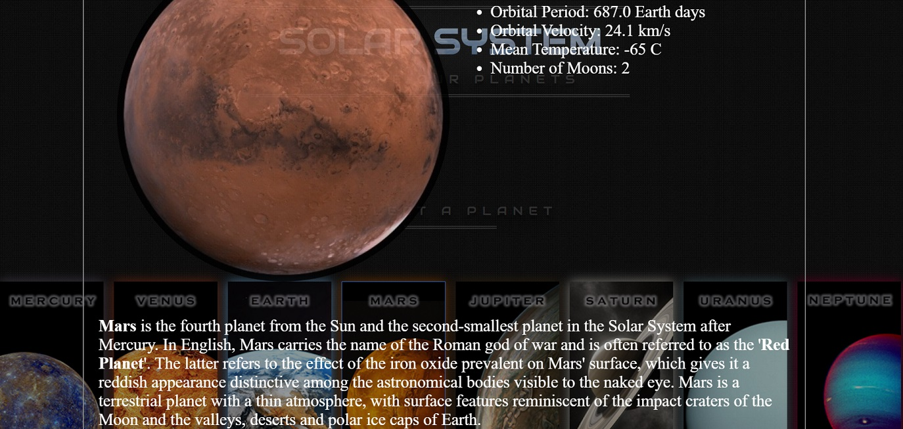

# Solar-System

#### How To Use:
A group project focused on providing educational and interactive content about our solar system.  It utilizes the Wikipedia API and features a CSS animated model of the Sun and orbiting planets.  Click on the planets to learn more about each one.

[See it Live](https://akaryrye.github.io/Solar-System)

#### Getting Started:
HTTPS:   `$ Git Clone https://github.com/akaryrye/Solar-System.git6556`

SSH:   `$ Git Clone git@github.com:akaryrye/Solar-System.git`

Then open `index.html` in your browser

#### Technologies:
HTML, CSS, jQuery, Ajax

#### Author:
Ryan K Alldrin

Thank you and I hope you enjoyed this app!
